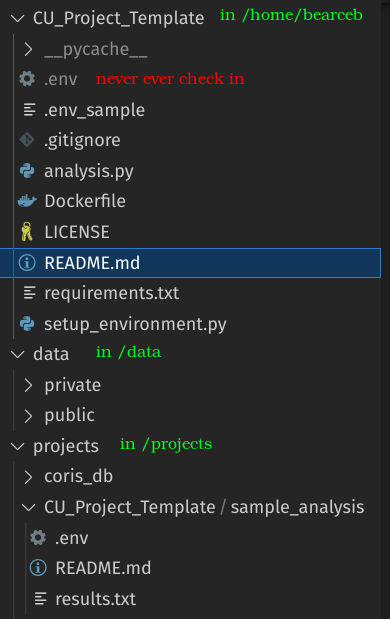

# CU_Project_Template
A template for using the CU environments and tracking generated data

## Helicopter view


# Infrastructure
This is always changing but ultimately the plan is to back data up on the CU Ophthalmology Isilon. That will have this structure:

> Note: git_repo_name is where results go, but not the repo itself. This shouldn't be where code lives.
```bash
/Some_Parent_Lab_Folder
  /data
    /public
    /private
  /projects
    /<git_repo_name>
      /sample_analysis1
      /sample_analysis2
    /<git_repo_name>
      /sample_analysis
    /<git_repo_name>
  ...
```
Right now we have these machines:
  * linux-tower1 (public only)
  * linux-tower2 (public only)
  * gpu-server (public and private PHI data)

Until further notice linux-tower1 will be the main source but on various machines we will likely need to partition data and projects as all data won't fit on one server. That is where the isilon above comes in but we need to wait for that and or the RAID (more details on that later, but it's a mountable data source that mimics the isilon).

* People should work in their home directories and clone git code there.
* A corresponding folder with the same exact name should be under /projects
* Any folders under /projects/<git repo> should have a manually made README.md with 3 things:
  - Github repo link
  - Commit hash that made this data
  - Source data for this particular analysis
* A copy of the .env used with code that stores /data source and any other config
> Later if you all think merging the .env data with the README.md for one README.md file that has everything, we can do that.

Ex: Organization with this very repo:
```bash
/data
  /...data used
/projects
  /CU_Project_Template
    /sample_analysis
/home/bearceb/CU_Project_Template
```

# Virtualenv based project
Frankly unless absolutely necessary using virtualenvs is better than using docker containers. It allows us to use proper permissions so we don't delete things. I highly HIGHLY recommend this and will demo this first for that reason.

## Setup Environment
Use any other virtualenv technology you like for use with requirements.txt:
```bash
mkdir ~/.virtualenvs
python3 -m venv ~/.virtualenvs/venv3.10.6
# ls ~/.virtualenvs # to see it
# activate it for your project
. ~/.virtualenvs/venv3.10.6/bin/activate
pip install -r requirements.txt
# do not ever commit .env, but rather copy .env_sample which is blank
cp .env_sample .env
```

env_sample:
```bash
# Inputs
## raw data input path
DATA_DIR=
## if source is not DATA_DIR but someone else's output in PROJECT_DIR
PROJECT_INPUT_DATA_DIR=
## your /projects/<git repo>/<specific analysis dir>
PROJECT_DIR=
```

You should be here after making a new repo for your project and setting it up:
```bash
(venv3.10.6) bearceb@OPH-D-JJ526S3:~/CU_Project_Template$
```

Fill in your .env:
```bash
# Inputs
## raw data input path
DATA_DIR=/data/public/retina_datasets/RIM/RIM-ONE_database_r1
## if source is not DATA_DIR but someone else's output in PROJECT_DIR
PROJECT_INPUT_DATA_DIR=
## your /projects/<git repo>/<specific analysis dir>
PROJECT_DIR=/projects/CU_Project_Template/sample_analysis
```

Run setup script:
```bash
python setup_environment.py
```

Run analysis:
```bash
python analysis.py
```

Explore directories:
```bash
ls /data/public/retina_datasets/RIM/RIM-ONE_database_r1
Deep  Early  Moderate  Normal  README.md
```

```bash
ls -a /projects/CU_Project_Template/sample_analysis
.  ..  .env  README.md  results.txt
```

```bash
cat /projects/CU_Project_Template/sample_analysis/.env
# Inputs
## raw data input path
DATA_DIR=/data/public/retina_datasets/RIM/RIM-ONE_database_r1
## if source is not DATA_DIR but someone else's output in PROJECT_DIR
PROJECT_INPUT_DATA_DIR=
## your /projects/<git repo>/<specific analysis dir>
PROJECT_DIR=/projects/CU_Project_Template/sample_analysis
```

```bash
cat /projects/CU_Project_Template/sample_analysis/README.md
# Git Repo
https://github.com/QTIM-Lab/CU_Project_Template.git

# Commit
c7afb610bf528d926827168bb1ba065e7336c904

# Raw Data Source
/data/public/retina_datasets/RIM/RIM-ONE_database_r1
```

```bash
cat /projects/CU_Project_Template/sample_analysis/results.txt
Folders and files in /projects/CU_Project_Template/sample_analysis direcory:
Normal,Early,README.md,Moderate,Deep
```

# Docker Based Project
I will skip the detail above as I will produce the same results with docker.

> Note it's usually best practice not to load code into a docker image but rather to mount it in. This has the advantage of being able to change the code without shelling into the container. There are instances where loading it in is good but for our type of work, I doubt this is the case.

## Build docker
```bash
DOCKER_IMAGE_NAME=bearceb/pytorch:2.0.0-cuda11.7-cudnn8-devel
docker build -f Dockerfile -t $DOCKER_IMAGE_NAME ./
```

## Launch docker
```bash
DOCKER_IMAGE_NAME=bearceb/pytorch:2.0.0-cuda11.7-cudnn8-devel
# We source .env beforehand as we have to mount the
# /data... and /projects... directories.
source .env
# RESIST THE TEMPTATION to mount /data and /projects directly and only
# That is exaclty how someone deletes everything for everyone.
# Mount your project analysis area ONLY.
# Always mount /data... directories with <path>:ro as shown below
# *** remember "rm -fr" is NOT the command to delete the French language pack ;) ***

CMD_OVERRIDE=

docker run \
  -it \
  --rm \
  --name bearceb_sample_analysis \
  -w /CU_Project_Template \
  -v $PWD:/CU_Project_Template \
  -v $DATA_DIR:$DATA_DIR:ro \
  -v $PROJECT_INPUT_DATA_DIR:$PROJECT_INPUT_DATA_DIR:ro \
  -v $PROJECT_DIR:$PROJECT_DIR \
  $DOCKER_IMAGE_NAME $CMD_OVERRIDE
```
> $PWD should be the root of git repo and /CU_Project_Template should be the name of git repo you are using

> Not ideal but since we are root here and not your normal user, we have to give git permission to allow a non-normal user (root) to do git commands
```bash
git config --global --add safe.directory /CU_Project_Template
```

Ex:
```bash
root@4525eed5ee86:/CU_Project_Template# git log
fatal: detected dubious ownership in repository at '/CU_Project_Template'
To add an exception for this directory, call:

        git config --global --add safe.directory /CU_Project_Template
root@4525eed5ee86:/CU_Project_Template# git config --global --add safe.directory /CU_Project_Template
root@4525eed5ee86:/CU_Project_Template# git log
commit 33032147aac320bcb820b37d2fb16ac9e4cbe693 (HEAD -> main, origin/main, origin/HEAD)
Author: bbearce <bbearce@gmail.com>
Date:   Fri May 5 14:17:31 2023 -0600

    variable update
```


At this point things should be the same as the virtualenv example above:
```bash
root@f6288da93e0d:/CU_Project_Template# ls
Dockerfile  LICENSE  README.md  __pycache__  analysis.py  requirements.txt  setup_environment.py
```

```bash
cat .env

# Inputs
## raw data input path
DATA_DIR=/data/public/retina_datasets/RIM/RIM-ONE_database_r1
## if source is not DATA_DIR but someone else's output in PROJECT_DIR
PROJECT_INPUT_DATA_DIR=
## your /projects/<git repo>/<specific analysis dir>
PROJECT_DIR=/projects/CU_Project_Template/sample_analysis

ls /data/public/retina_datasets/RIM/RIM-ONE_database_r1
Deep  Early  Moderate  Normal  README.md
```

## Run setup and analysis scripts

Run setup script:
```bash
python setup_environment.py
```

Run analysis:
```bash
python analysis.py
```
